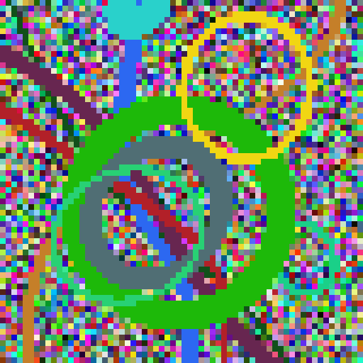

# Unique Image Generator

This project is a web application that generates unique, visually interesting images based on user input. It uses cryptographic hashing and various mathematical functions to create complex, deterministic patterns directly in the browser.

## Example Output

Here's an example of an image generated using the input "sigmoid":

## Features

- Generates a unique 64x64 pixel image based on any text input
- Creates larger 512x512 pixel versions of the same image
- Utilizes SHA-256 hashing to ensure consistency and uniqueness
- Implements rotated sigmoids and distorted circles for visual complexity
- Outputs both small (output.png) and large (outputLarge.png) versions of the generated image
- Runs entirely in the browser, no server-side processing required

## How It Works

1. The user provides a text input through the web interface.
2. The input is hashed using SHA-256.
3. The hash is used to generate an initial RGB grid.
4. Rotated sigmoids are drawn on the grid, with parameters determined by the hash.
5. Distorted circles are added to the grid, again using hash-derived parameters.
6. The resulting grid is rendered as two images: a 64x64 pixel version and a 512x512 pixel version.

## Dependencies

- Web browser with JavaScript enabled
- No server-side dependencies required

## Usage

1. Open the web application in your browser
2. Enter your desired input in the provided text field
3. Click the "Generate" button
4. The application will generate and display two images: a small 64x64 pixel version and a large 512x512 pixel version

## Functions

- `dataToRGBGrid`: Converts input data to an RGB grid
- `drawRotatedSigmoids`: Adds sigmoid curves to the grid
- `drawDistortedCircles`: Adds distorted circles to the grid
- `writeGridToImage`: Renders the grid as a 64x64 pixel image
- `writeGridToLargeImage`: Renders the grid as a 512x512 pixel image
- `processInput`: Main function that orchestrates the image generation process

## Future Improvements

- Add more shape types and patterns
- Implement color schemes or palettes
- Allow for custom output sizes
- Optimize performance for larger images or more complex patterns
- Add options for downloading generated images

Feel free to contribute to this project by submitting pull requests or opening issues for bugs and feature requests.
